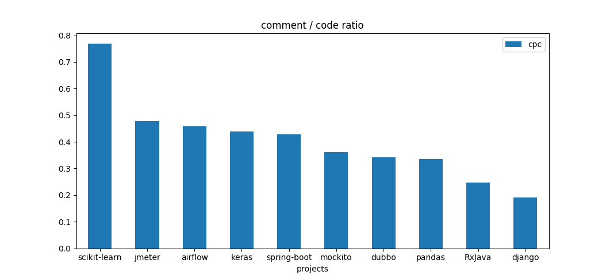
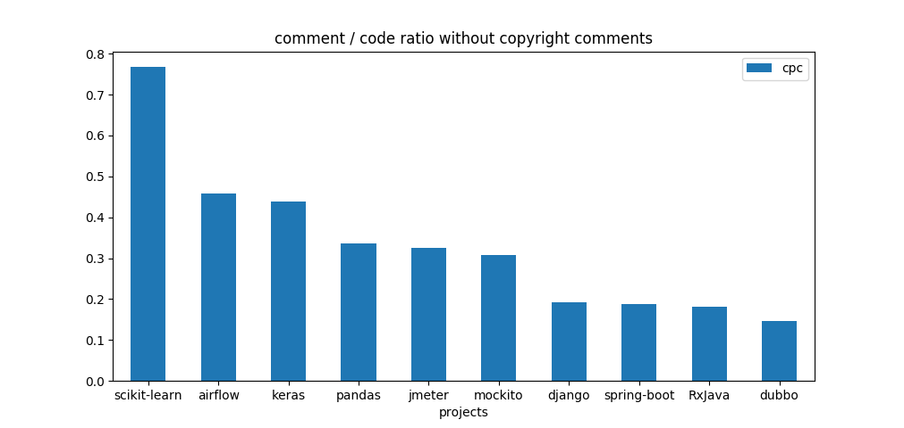
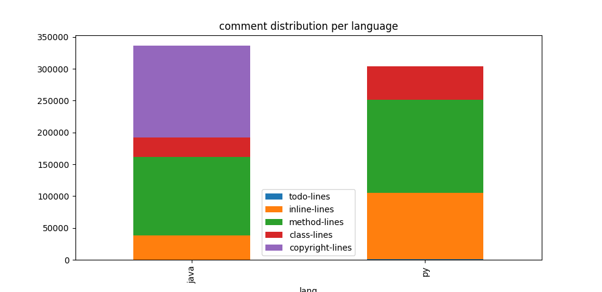
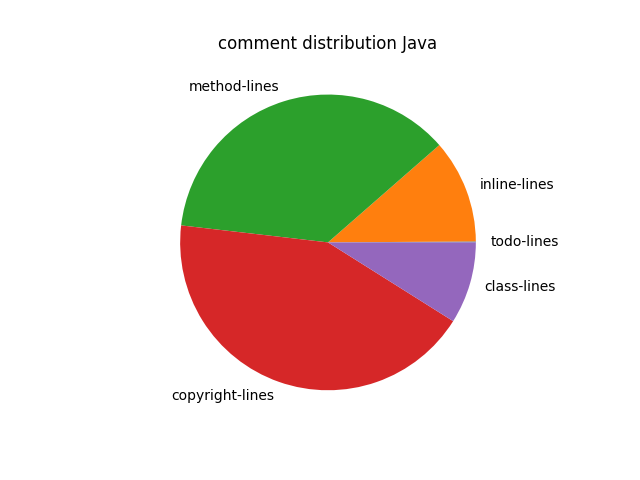
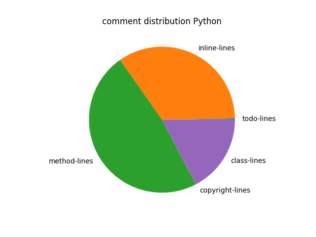
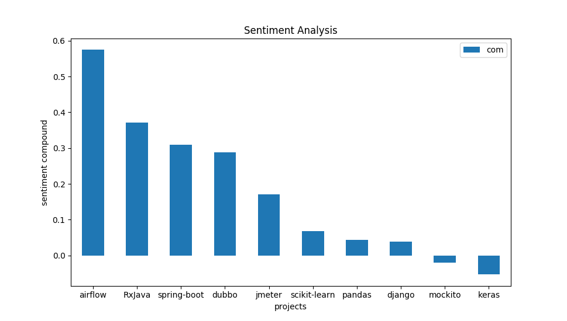

# Results

## Python projects

project | total lines | lo-code | lo-comment 
--- | ---: | ---: | ---: |
airflow | 198211 | 135806 | 62405 
django | 293604 | 246316 | 47288
pandas | 346242 | 259166 | 87076 |
scikit-learn | 200389 | 113305 | 87084
keras | 64507 | 44857 | 19650

## Java projects

project | total lines | lo-code | lo-comment 
--- | ---: | ---: | ---: |
jmeter | 210262 | 142261 | 68001
mockito | 67773 | 49751 | 18022
RxJava | 369438 | 296142 | 73296
spring-boot | 406582 | 284490 | 122092
okhttp | 41173 | 35527 | 5646

## Figures

